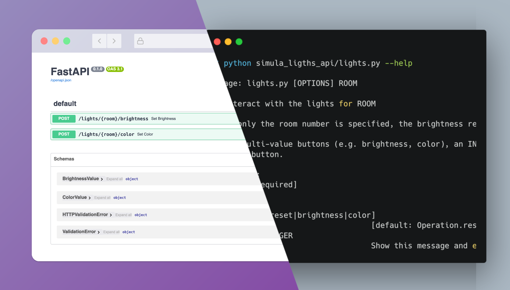

# API and CLI for lights at KA23



## Install

### with `pipx`


```
pipx install git+https://github.com/Northo/simula-lights-api
```

This will install the `lights` command.


### with `poetry`

This is suitable if you want to develop on the package.

Clone the repo and run `poetry install`.


## Usage
You must give your office number as the first argument:

```
lights ROOM
```

With no other arguments, the lights are reset:

```
lights ROOM
```

You can also specify brightness or color with a range 0-4:

```
lights ROOM brightness 2
```
or
```
lights ROOM color 3
```

## Credits

The script is written by [minrk](https://github.com/minrk) and packaged by [finsberg](https://github.com/finsberg)
The script was wrapped as an API by [northo](https://github.com/Northo).
